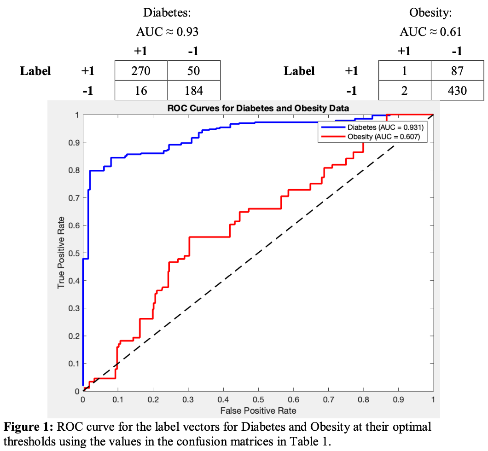

# Classifying the Diabetes and Obesity status of 520 patients based on 15 health metrics using LDA Classification

This project explores how well 15 provided health variables can be used to classify the diabetes and obesity status for 520 patients using LDA classification.

LDA is a dimensionality reduction and classification algorithm which works on the principle of maximising between cluster separation and minimizing within cluster separation while modelling data using label vectors, making it an effective supervised algorithm to explore datasets where two features and their merit as classification bases needs to be explored.

The classifier assessment is done using ROC curves which graphically evaluates the overall performance of binary clusterings produced by LDA. The assessment is supported by the confusion matrices for the features being analysed for classification as they summarize the performance of the classifications in terms of true / false positives and negative which can further be used to evaluate the accuracy, precision and F scores of a classification.

    

